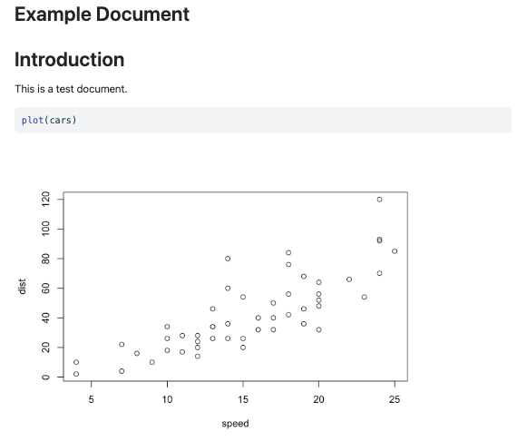

# Overview

This guide demonstrates how to set up a reproducible project using Git and GitHub. It walks through repository creation, branching, merging, resolving conflicts, and managing commit history.

Each step includes:

- the command used  
- what it does  
- why it is important  

---

# 1. Create a Quarto Project

Start by creating a new project folder. In this case, we will use the folder "Example". Inside this folder, create a new Quarto document named "example.qmd". This will be the main file for our project.

The output of "example.qmd" will be the html file "example.html". This file will be generated when we render the Quarto document.

It will look like this:



# 2. Initialise a Git Repository

Open the terminal in your project folder and run:

```bash
git init
```

Check the repository status:

```bash
git status
```

You should see example.qmd listed as an untracked file.

Now stage and commit it:

```bash
git add .
git commit -m "Initial commit with example Quarto document"
```

## What’s happening:

git add prepares files for saving
git commit records a snapshot of your project

## Why this matters:

Commits allow you to track changes over time and revert if needed.

# 3. Link to GitHub Repository

Create a new repository on GitHub, then link it:

```bash
git remote add origin <repository-URL>
git branch -M main
git push -u origin main
```

## Why this matters:

GitHub stores your project remotely, acting as a backup and enabling collaboration.

# 4. Create and Use a Branch

Create a new branch:

```bash
git checkout -b testbranch
```

Modify example.qmd by adding:

# Additional Content

This section was added in the test branch.

```{r}
hist(cars$speed)
```

Commit the changes:

```bash
git add .
git commit -m "Added histogram section on testbranch"
git push -u origin testbranch
```

## What’s happening:

You are working on a separate version of the project.

## Why this matters:

Branches allow experimentation without affecting the main version.
